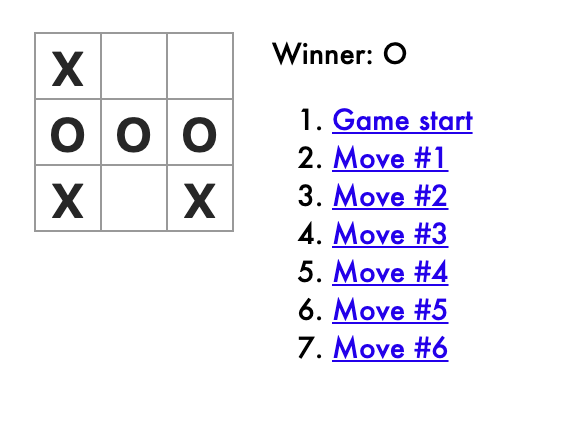

# React100-Tic-Tac-Toe



First project in the *React100* course at San Diego Code School gives you a walkthrough of React 
architecture and building a web app tic tac toe game complete with a display for player moves.

## Please feel free to demo the project by taking these steps..
```
Clone or fork the repo
```
```
npm install
```
```
npm start
```
```
Open your browser to view on localhost: 3000
```
* **Thank you**, ***-Miles Mickelson***
